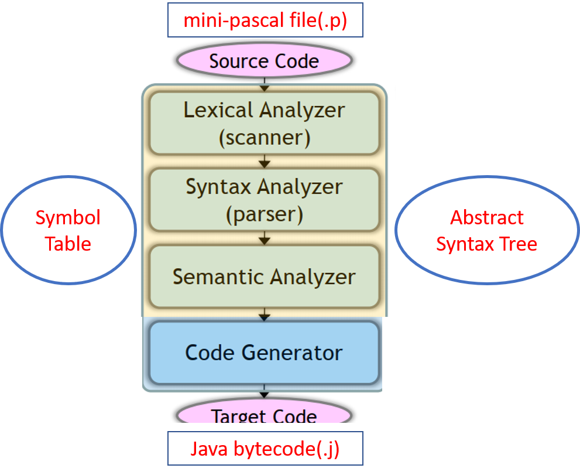

# Minipascal-Compiler

## Architecture


## Usage

- Setting Environment
1. First install docker in your computer
2. clone this repo
```
git clone https://github.com/Platisenic/Minipascal-Compiler.git
cd Minipascal-Compiler
./activate.sh
make
```

- Execute your own minipascal file(.p)
```
cd exec
./run.sh [filename without extension]
// Example: test1.p is already in exec folder
// Enter ./run.sh test1
// You will see the result in terminal
```

## mini-pascal rules
- In minipascal, upper-case letters and lower-case letters in names are
considered equivalent. For instance, aBcD = abcd = ABCD. This is
different from the rules in the C language

- Comments are marked with two slashes and extend to the end of the
line. For example,
```
// this is a comment.
Comments may also be enclosed in the pair /* and */, such as
/* hello, this is also a comment. */
This comments may span multiple lines. You may invent your own
syntax for comments if necessary.
```

- STRING is the keyword that represents a basic type. You need to define
a reasonable regular expression for string constants, such as "abcdef"
and "alphan"beta" and "goodnnbadnnugly". In minipascal, string
constants are used only in a printString function. There are no operators on strings. However, you may even build a library for functions
related to strings (for extra points). A string constant may not span
across multiple lines

- A programmer cannot define new type names

- We use name equivalence for type compatibility. You need to design
a reasonable type system for minipascal. You can use a simple type
system for minipascal

- We disallow addition/subtraction/multiplication/division between an
integer and a real number. We also disallow comparison between an
integer and a real number. Furthermore, we will not test comparison
between two strings. We do not allow assigning a real value to an
integer variable. We do not allow assigning an integer value to a real
variable either

- A function’s value is the value of the variable whose name is the same
as the function. For example
```
function addition(a, b: integer) : integer;
  begin
  addition := a + b; // this is the return value
  end;
```
If a function did not set up a return value, a compiler may generate an
error message.

- We may assign an arry to another. For example
```
var a, b: array [ 23 .. 57 ] of integer;
a := b;
```

- All parameters are passed by value

- We can assign a whole array to a variable. For example,
```
VAR a, b : array [ 1 .. 10 ] of array [ 1 .. 10 ] of Integer;
a[5] := b[3];
```

- Array indices could be negative. For example
```
VAR a : array [ -5 .. 5 ] of integer ;
a[ -5 ] := -5;
a[ -1 ] := -10;
```

- In minipascal, there are strings, such as "hello". A string constant is
enclosed in a pair of double quotes. A string constant may not contain
end-of-lines and double quotes unless they are properly escaped, as in
C. You need to define a regular exrepssion for string constants. There
are no char type, no char variables, no char constants.

- An identifier begins with an English letter a-z and may include English
letters, digits (0-9), and the underscores .

- Illegal characters should be reported character by character.

- 
